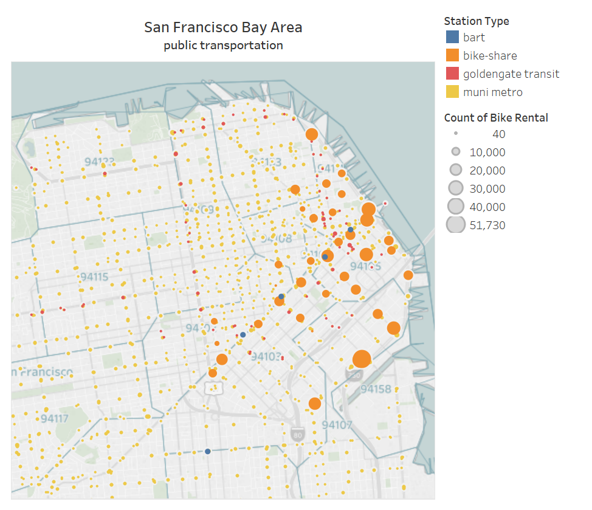

```{r setup, include=FALSE}
knitr::opts_chunk$set(echo = TRUE)
```

# **<span style="color:#2B65EC">Bay Area Bikeshare at San-Francisco </span>**  
*<span style="color:#2B65EC">Yarden Israeli, Amitai Serphos & Omer Klein </span>*  



## **<span style="color:#736F6E">The Prime Objective </span>**
### **<span style="color:#E4287C">Build prediction model for target station given rental information </span>** 

## **<span style="color:#736F6E">Business Potential </span>**
* <font size="+1">new marketing platform </font>  
    + <font size="+0.5">**B2C** - market products and services for rider's personal use </font>
    + <font size="+0.5">**B2B** - provide useful information to municipality/tourist sites/public tranportation like- traffic,popular stations </font>

## **<span style="color:#736F6E">Challenges </span>**
* <font size="+1">Regression Tree Model Prediction </font>  
    + <font size="+0.5">Degeneration of the coordinates </font>
    + <font size="+0.5">Most descriptions of decision tree learning assume a single target, but in our case- prediction of location requires two parameters - Lat-Lon (or East-North) </font>
* <font size="+1">Classification Tree Model Prediction </font>  
    + <font size="+0.5">We have 37 classes (stations) - Tree based model has a limit of 32 classes </font>
    
## **<span style="color:#736F6E">Our Approach </span>**
* <font size="+1">Regression Tree Model Prediction </font>  
    + <font size="+0.5">convert GEO coordinates to UTM - this is a win-win situation (
more comfortable representation & easy to compute distances) </font>
    + <font size="+0.5">predict each variable separately, but we also show a method for multi target prediction</font>
* <font size="+1">Classification Tree Model Prediction </font>  
    + <font size="+0.5">data reduction </font>

## **<span style="color:#736F6E">Data Overview </span>**
```{r}
train = read.csv("C:\\Users\\User\\Dropbox\\IDC\\Courses\\BusinessAnalytics\\project\\bike\\scriptsFlowR\\dataSets\\trainSuscribers2016_4RT1.csv", as.is = TRUE)
test = read.csv("C:\\Users\\User\\Dropbox\\IDC\\Courses\\BusinessAnalytics\\project\\bike\\scriptsFlowR\\dataSets\\testSuscribers2016_4RT1.csv", as.is = TRUE)

#reduce size of datasets
#set.seed(1)
#train = train[sample(150000),]
#test = test[sample(50000),]

#split to trainX & trainY
RT.trainX = train[-c(1,5,15,16,18)]
RT.trainY = train[-c(1,5,15,16,17)]
RT.test = test[-c(1,5,15,16,17,18)]

str(rbind(train,test))
```

## **<span style="color:#736F6E">Regression Tree Method </span>**
#### Model learning on Train data - X coordinate (East-West)
First run the Tree model for all predictors
```{r}
#install.packages("tree")
library("tree")
RT.X = tree(X_end ~ . , data = RT.trainX)
plot(RT.X)
text(RT.X, pretty = 0, cex=0.5)
```

```{r}
summary(RT.X)
```
Now, let's try to estimate a more complex model that accounts another variables too.  
For example, change the control growth parameter *mindev* to 0.001  
(the deviance at the node under consideration has to be at least 0.1% of the root-node deviance)
```{r}
RT.Xcomplex = tree(X_end ~ . , data = RT.trainX, mindev = 0.001)
plot(RT.Xcomplex)
text(RT.Xcomplex, pretty = 0, cex=0.5)
```

```{r}
summary(RT.Xcomplex)
```

#### Model evaluation on Test data - X coordinate (East-West)
First predict the X-axis value for the test data.
```{r}
prediction.RTxcomplex= predict(RT.Xcomplex,RT.test)
summary(prediction.RTxcomplex)
```
Now we can compute RMSE - square root of the mean of square residuals
```{r}
predictionErr.RTxcomplex = test$X_end - prediction.RTxcomplex
RSS = sum(predictionErr.RTxcomplex ^2)
MSE <- RSS/length(predictionErr.RTxcomplex)
RMSE.RTxcomplex <- sqrt(MSE)
RMSE.RTxcomplex
```

We can also compare between the models
```{r}
prediction.RTx = predict(RT.X,RT.test)
predictionErr.RTx = test$X_end - prediction.RTx
RSS = sum(predictionErr.RTx ^2)
MSE <- RSS/length(predictionErr.RTx)
RMSE.RTx <- sqrt(MSE)
RMSE.RTx
```

#### Model learning & Evaluation - Y coordinate (South-North)
Now we can run the same prediction process on the Y axis
```{r}
RT.Ycomplex = tree(Y_end ~ . , data = RT.trainY, mindev = 0.001)
plot(RT.Ycomplex)
text(RT.Ycomplex, pretty = 0, cex=0.5)
```

```{r}
summary(RT.Ycomplex)
```
Predict the Y-axis value for the test data and compute test error (in meters)
```{r}
prediction.RTycomplex = predict(RT.Ycomplex,RT.test)
predictionErr.RTycomplex = test$Y_end - prediction.RTycomplex
RSS = sum(predictionErr.RTycomplex ^2)
MSE <- RSS/length(predictionErr.RTycomplex)
RMSE.RTycomplex <- sqrt(MSE)
RMSE.RTycomplex
```

#### Model Evaluation - End-stations locations (XY coordinates)
Now we can compute the total error of end-stations prediction.  
(Achieved by Euclidean distance calculation in 2D)
```{r}
dist_2D = sqrt((predictionErr.RTxcomplex)^2 +(predictionErr.RTycomplex)^2)
RSS = sum(dist_2D^2)
MSE <- RSS/length(dist_2D)
RMSE.RTxy <- sqrt(MSE)
RMSE.RTxy
```
The model prediction is 80 meters away from the actual position of the stations.  
We want better percision !

## **<span style="color:#736F6E">Random Forest Method </span>**
#### Model learning on Train data - X coordinate (East-West)
First run the RF model for all predictors
```{r}
#install.packages("randomForest")
library(randomForest)
#RF.X = randomForest(X_end ~ . , data = RT.trainX, ntree = 50, do.trace=TRUE)
load("C:\\Users\\User\\Dropbox\\IDC\\Courses\\BusinessAnalytics\\project\\bike\\scriptsFlowR\\RF.X.RData")
RF.X
```

Now let's check the contribution of each variable on predicting the target variable
```{r}
varImpPlot(RF.X)
```

#### Model evaluation on Test data - X coordinate (East-West)
First predict the X-axis value for the test data.
```{r}
prediction.RFx <- predict(RF.X,RT.test)
summary(prediction.RFx)
```
Now we can compute RMSE - square root of the mean of square residuals
```{r}
predictionErr.RFx = test$X_end - prediction.RFx
RSS = sum(predictionErr.RFx ^2)
MSE <- RSS/length(predictionErr.RFx)
RMSE.RFx <- sqrt(MSE)
RMSE.RFx
```
#### Model learning & Evaluation - Y coordinate (South-North)
Now we can run the same prediction process on the Y axis
```{r}
#RF.Y = randomForest(Y_end ~ . , data = RT.trainY, ntree = 50,do.trace=TRUE)
load("C:\\Users\\User\\Dropbox\\IDC\\Courses\\BusinessAnalytics\\project\\bike\\scriptsFlowR\\RF.Y.RData")
RF.Y
```
Predict the Y-axis value for the test data and comute test error (in meters)
```{r}
prediction.RFy <- predict(RF.Y,RT.test)
predictionErr.RFy = test$Y_end - prediction.RFy
RSS = sum(predictionErr.RFy ^2)
MSE <- RSS/length(predictionErr.RFy)
RMSE.RFy <- sqrt(MSE)
RMSE.RFy
```
And again, a a significant improvement.

#### Model Evaluation - End-stations locations (XY coordinates)
Compute the total error of end-stations prediction.
(Achieved by Euclidean distance calculation in 2D)
```{r}
dist_2D = sqrt((predictionErr.RFx)^2 +(predictionErr.RFy)^2)
RSS = sum(dist_2D^2)
MSE <- RSS/length(dist_2D)
RMSE.RFxy <- sqrt(MSE)
RMSE.RFxy
```
## **<span style="color:#736F6E">Multivariate Tree Method </span>**
Most descriptions of decision tree learning assume a single target, which may be nominal (classification) or numerical (regression).  
**Blockeel, De Raedt, and Ramon (1998)** argued that decision tree learning can easily be extended towards the case of multi-target prediction, by extending the notion of class entropy
or variance towards the multi-dimensional case.  
They define the variance of a set as the mean squared distance between any element of a set and a centroid of the set. Depending on the definition of distance, which could be Euclidean distance in a multidimensional target space, a decision tree will be built that gives accurate predictions for multiple target variables.  


#### Reducing the data
For computational reasons, we took a 1,000 samples of rentals from training set and 250 random samples from testing set:
```{r}
set.seed(7)
inds_train = sample(1:nrow(train),1000)
inds_test = sample(1:nrow(test),250)
train_inputs_mat = as.matrix(train[inds_train,-c(1,5,15,16,17,18)])
train_outputs_mat = as.matrix(train[inds_train,c(17,18)])
test_inputs_mat = as.matrix(test[inds_test,-c(1,5,15,16,17,18)])
```
#### learn MVT model & get Prediction in 2D
```{r}
#install.packages("MultivariateRandomForest")
library(MultivariateRandomForest)
mvrPredict = build_forest_predict(train_inputs_mat,train_outputs_mat,1,12,5,test_inputs_mat)
str(as.data.frame(mvrPredict))
```
#### compute test error
```{r warning=FALSE}
predictionErr.MVT = sqrt((test$X_end[inds_test] - mvrPredict[,1])^2 + (test$Y_end[inds_test] - mvrPredict[,2]))
predictionErr.MVT = na.omit(predictionErr.MVT)
RSS = sum(predictionErr.MVT^2)
MSE <- RSS/length(predictionErr.MVT)
RMSE.MVT <- sqrt(MSE)
RMSE.MVT
```
#### compare to Tree method model with one variable predcition abillity
```{r}
RT.X1000 = tree(X_end ~ . , data = RT.trainX[inds_train,])
prediction.RTx1000 = predict(RT.X1000,RT.test[inds_test,])
predictionErr.RTx1000 = test$X_end[inds_test] - prediction.RTx1000

RT.Y1000 = tree(Y_end ~ . , data = RT.trainY[inds_train,])
prediction.RTy1000 = predict(RT.Y1000,RT.test[inds_test,])
predictionErr.RTy1000 = test$Y_end[inds_test] - prediction.RTy1000

predictionErr.RTx1000 = na.omit(predictionErr.RTx1000)
predictionErr.RTy1000 = na.omit(predictionErr.RTy1000)
dist_2D = sqrt((predictionErr.RTx1000)^2 +(predictionErr.RTy1000)^2)
RSS = sum(dist_2D^2)
MSE <- RSS/length(dist_2D)
RMSE.RTxy1000 <- sqrt(MSE)
RMSE.RTxy1000
```

## **<span style="color:#736F6E">KNN Classification Method </span>**
```{r}
library(class)
#apply KNN with based on all features and predict end station ID
bike.train = train[-c(1,5,15,17,18)]
bike.test = test[-c(1,5,15,17,18)]
train.knn = bike.train[,-c(13)]
test.knn = bike.test[-c(13)]
trainClass.knn = train[,13]
knn.pred = knn(train.knn,test.knn,trainClass.knn,k = 10)
#compute KNN performance
knn.table = table(knn.pred,bike.test[,13])
#Accuracy
knn.accuracy = sum(diag(knn.table))/sum(knn.table)
knn.accuracy
#Misclassification
knn.misClassification = 1 - knn.accuracy
knn.misClassification
```
## **<span style="color:#736F6E">Classification Tree Method </span>**
#### Data Preprocessing
```{r}
bike.train = train[-c(1,5,15,17,18)]
bike.test = test[-c(1,5,15,17,18)]
# because of max 32 factors randomly remove start and end stations
set.seed(7)
start_stations_smaple = sample(unique(bike.train$start_station_id),10)
end_stations_smaple = sample(unique(bike.train$end_station_id),10)
bike.train = bike.train[(bike.train$start_station_id %in% start_stations_smaple),]
bike.train = bike.train[(bike.train$end_station_id %in% end_stations_smaple),]
bike.test = bike.test[(bike.test$start_station_id %in% start_stations_smaple),]
bike.test = bike.test[(bike.test$end_station_id %in% end_stations_smaple),]
```

convert charecter variables into factors in train
```{r}
bike.train$start_station_id = as.factor(bike.train$start_station_id)
bike.train$end_station_id = as.factor(bike.train$end_station_id)
```
convert charecter variables into factors in test
```{r}
bike.test$start_station_id = as.factor(bike.test$start_station_id)
bike.test$end_station_id = as.factor(bike.test$end_station_id)
```

#### Model learning on Train data
First run the Tree model for all predictors
```{r}
library("tree")
bike_CART <- tree(end_station_id ~ . , data = bike.train)
plot(bike_CART)
text(bike_CART, pretty = 0, cex=0.5)
```

```{r}
summary(bike_CART)
```
#### Model evaluation on Test data
```{r}
false_positive_fun <- function(table, x) {
sum(table[,x])-table[x,x]
}
false_negative_fun <- function(table, x) {
sum(table[x,])-table[x,x]
}
true_positive_fun <- function(table, x) {
table[x,x]
}
```
compute confusion matrix
```{r}
tree_test_results <- predict(bike_CART,bike.test[-c(13)],type="class")
table_tree = table(bike.test$end_station_id,tree_test_results)
table_tree
```
```{r}
accuracy_tree = sum(diag(table_tree))/sum(table_tree)
#False Positive (When we predict Yes but its actuall No)
FP = sapply(1:10, false_positive_fun,  table = table_tree)
#False Negative (When we predict No but its actuall Yes)
FN = sapply(1:10, false_negative_fun,  table = table_tree)
#True Positive (When it's actually yes, how often does it predict yes?)
TP = sapply(1:10, true_positive_fun,  table = table_tree)
stations_id = colnames(table_tree)
confusion_tree = cbind(stations_id, TP, FN, FP)
confusion_tree
```
Accuracy - Tree for Classification
```{r}
accuracy_tree
```
Recall - Tree for Classification
```{r}
confusionDF = as.data.frame(confusion_tree)
confusionDF$TP = as.numeric(as.character(confusionDF$TP))
confusionDF$FN = as.numeric(as.character(confusionDF$FN))
confusionDF$FP = as.numeric(as.character(confusionDF$FP))
recall4each = confusionDF$TP/(confusionDF$TP+confusionDF$FN)
confusionDF$recall = recall4each
confusionDF
```
```{r}
recall = mean(recall4each)
recall
```

## **<span style="color:#736F6E">Classification Complex Tree Method </span>**
#### Model learning on Train data
First run the Tree model for all predictors
```{r}
library("tree")
bike_CART_complex <- tree(end_station_id ~ . , data = bike.train, mindev = 0.005)
plot(bike_CART_complex)
text(bike_CART_complex, pretty = 0, cex=0.5)
```

```{r}
summary(bike_CART_complex)
```
#### Model evaluation on Test data
```{r}
false_positive_fun <- function(table, x) {
sum(table[,x])-table[x,x]
}
false_negative_fun <- function(table, x) {
sum(table[x,])-table[x,x]
}
true_positive_fun <- function(table, x) {
table[x,x]
}
```
compute confusion matrix
```{r}
ctree_test_results <- predict(bike_CART_complex,bike.test[-c(13)],type="class")
table_ctree = table(bike.test$end_station_id,ctree_test_results)
table_ctree
```
```{r}
accuracy_cx = sum(diag(table_ctree))/sum(table_ctree)
#False Positive (When we predict Yes but its actuall No)
FP = sapply(1:10, false_positive_fun,  table = table_ctree)
#False Negative (When we predict No but its actuall Yes)
FN = sapply(1:10, false_negative_fun,  table = table_ctree)
#True Positive (When it's actually yes, how often does it predict yes?)
TP = sapply(1:10, true_positive_fun,  table = table_ctree)
stations_id = colnames(table_ctree)
confusion_cx = cbind(stations_id, TP, FN, FP)
confusion_cx
```
Accuracy - Complex Tree for Classification
```{r}
accuracy_cx
```
Recall - Complex Tree for Classification
```{r}
confusionCX = as.data.frame(confusion_cx)
confusionCX$TP = as.numeric(as.character(confusionCX$TP))
confusionCX$FN = as.numeric(as.character(confusionCX$FN))
confusionCX$FP = as.numeric(as.character(confusionCX$FP))
recall4each = confusionCX$TP/(confusionCX$TP+confusionCX$FN)
confusionCX$recall = recall4each
confusionCX
```
```{r}
recall = mean(recall4each)
recall
```
## **<span style="color:#736F6E">Random Forest (Classification) Method </span>**
#### Model learning on Train data
First run the RF model for all predictors
```{r}
library("randomForest")
set.seed(7)
bike_RF <- randomForest(end_station_id ~ . , data = bike.train)
bike_RF
plot(bike_RF)
importance(bike_RF)
varImpPlot(bike_RF)
```

#### Model evaluation on Test data
```{r}
RF_test_results <- predict(bike_RF,bike.test[-c(13)])
table_RF = table(bike.test$end_station_id,RF_test_results)
table_RF
```
```{r}
accuracy_RF = sum(diag(table_RF))/sum(table_RF)
#False Positive (When we predict Yes but its actuall No)
FP = sapply(1:10, false_positive_fun,  table = table_RF)
#False Negative (When we predict No but its actuall Yes)
FN = sapply(1:10, false_negative_fun,  table = table_RF)
#True Positive (When it's actually yes, how often does it predict yes?)
TP = sapply(1:10, true_positive_fun,  table = table_RF)
stations_id = colnames(table_RF)
confusion_RF = cbind(stations_id, TP, FN, FP)
confusion_RF
```
Accuracy- Random Forest for Classification
```{r}
accuracy_RF
```
Recall- Random Forest for Classification
```{r}
confusionDF_RF = as.data.frame(confusion_RF)
confusionDF_RF$TP = as.numeric(as.character(confusionDF_RF$TP))
confusionDF_RF$FN = as.numeric(as.character(confusionDF_RF$FN))
confusionDF_RF$FP = as.numeric(as.character(confusionDF_RF$FP))
recall4each_rf = confusionDF_RF$TP/(confusionDF_RF$TP+confusionDF_RF$FN)
confusionDF_RF$recall = recall4each_rf
confusionDF_RF
```
```{r}
recall_rf = mean(recall4each_rf)
recall_rf
```